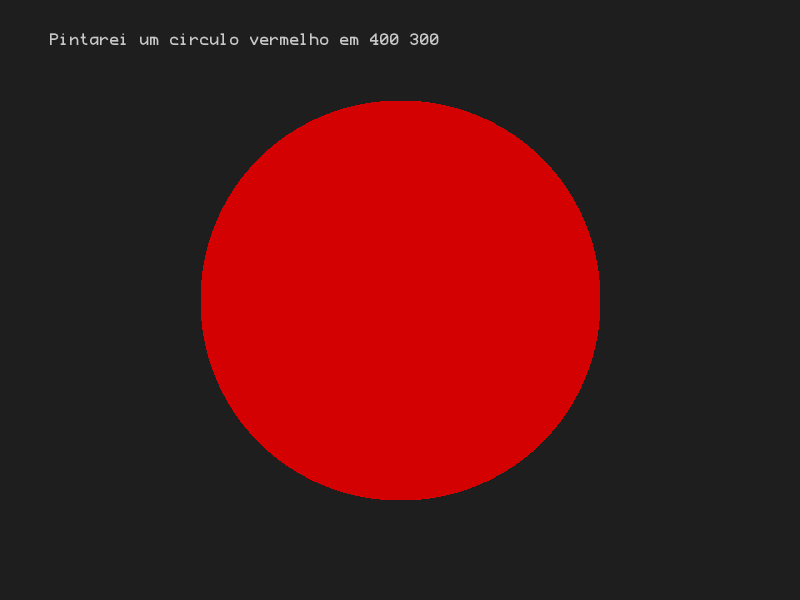
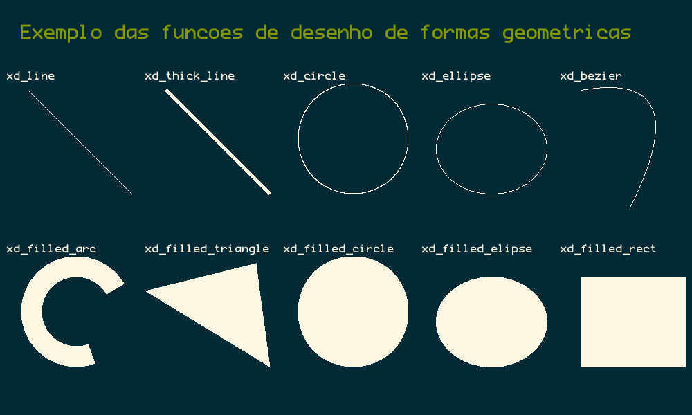

# Escrevendo, desenhando e pintando em PNGs usando C

O objetivo desse projeto é criar uma biblioteca header only para programar em C que seja capaz de criar, escrever e desenhar em pngs sem a necessidade de bibliotecas externas ou dependencias.

O código a seguir cria um bitmap, escreve um texto, pinta um círculo, salva no arquivo exemplo.png e sai. Você precisará apenas da biblioteca **xpaint.h** para o seu computador e criar o arquivo **exemplo_base.c** com o seguinte conteúdo.


```c
#include "xpaint.h"

int main(){
    int largura = 800, altura = 600;
    /* cria um bitmap de 800x600 */
    x_open(largura, altura); 
    /* escreve usando a font default na posicao x=50, y=30 */
    /* utilizando o mesmo formato do printf */
    x_write(50, 30, "Pintarei um circulo vermelho em %d %d", largura/2, altura/2);
    /* muda a cor do pincel para vermelho */
    xs_color(RED);
    /* desenha um circulo preenchido com centro no meio da tela e raio 200 */
    xd_filled_circle(largura/2, altura/2, 200);
    /* salva no arquivo exemplo.png */
    x_save("figura_base");
    /* libera os recursos alocados */
    x_close();
    return 0;
}
```

## Compilando e rodando

Se estiver fazendo manual, copie o arquivo xpaint.h para a pasta e o arquivo exemplo_base.c e compile manualmente. Se estiver utilizando alguma ide como _Geany_ ou _Dev c++_, basta colocar os dois arquivos no mesmo pasta e mandar executar o exemplo_base.c.

```
# rodando pelo terminal
gcc exemplo_base.c -o exemplo_base
./exemplo_base
```

Ele deve gerar o arquivo figura_base.png que se parece com isso:



Outros código de exemplo são os exemplo_cores.c, exemplo_draw.c, exemplo_texto.c.





Se der um make, ele vai compilar e gerar na pasta as mesmas figuras que estão na pasta de figuras.

Esta é uma biblioteca header only, ou seja, não está dividida em .c e .h. Declarações e definições estão todas no .h. 

Se você der o include na biblioteca ele vai incluir as declarações e as definições, ou seja, cabeçalhos e implementações. Se estiver utilizando módulos e precisar fazer outras inclusões da biblioteca, todas as outras inclusões devem ser precedidas de 

```
#define H_ONLY
```

# Documentação das funções

Você pode encontrar as funções todas documentadas no arquivo xpaint.h, mas eu copio e colo abaixo.

```c
/*
Autor: 
    nome: David Sena Oliveira
    email: sena.ufc@gmail.com

Principais fontes:
    png: https://lodev.org/lodepng
    tff: https://github.com/nothings/stb
    funções de desenho e matemáticas estão comentadas nas funções 

Licença: GPLv3

Versão: 0.1
*/


/*
###############################################
######## DEFINES e TIPOS BASICOS ##############
###############################################
*/

/* apelido para um char sem sinal */
typedef unsigned char uchar;

/* struct que representa uma cor RGB */
typedef struct{
    uchar r;
    uchar g;
    uchar b;
} XColor;

/* cria e retorna uma cor passando rgb */
XColor make_color(uchar r, uchar g, uchar b);

/* lista de cores default */
extern XColor RED;
extern XColor GREEN;
extern XColor BLUE;
extern XColor YELLOW;
extern XColor CYAN;
extern XColor MAGENTA;
extern XColor ORANGE;
extern XColor VIOLET;
extern XColor WHITE;
extern XColor BLACK;

/*
###############################################
######## ABRINDO, FECHANDO, SALVANDO ##########
###############################################
*/

/* abre um bitmap com essas dimensões */
void x_open(int width, int height);

/* finaliza o bitmap liberando os recursos */
void x_close();

/* para salvar um png no arquivo
   não inclua a extensão .png no nome do arquivo
*/
void x_save(const char* filename);

/*
###############################################
#### PLOTANDO, ESCREVENDO, LIMPANDO ###########
###############################################
*/

/* a funcao plot pinta o pixel usando a cor */
void x_plot(int x, int y);

/* a funcao write escreve um texto text, na posição px, py.
   retorna o x da posição após o último caractere escrito.
*/
int x_write(int x, int y, const char * format, ...);

/* limpa a tela inteira com a mesma cor */
void x_clear(XColor color);

/*
###############################################
### FUNÇÕES SET: Cor, Fonte, Paleta de Cores ##
###############################################
*/

/* muda a cor do pincel para todas as funcoes de desenho */
void xs_color(XColor color);

/* define uma cor na palheta de caracteres */
void xs_palette(char c, XColor color);

/* mudar o tamanho da fonte em pixels */
void xs_font_size(int size);

/* muda a font passando o path da nova fonte */
void xs_font(const char* filename);

/*
###############################################
############## FUNÇÕES GET ####################
###############################################
*/

/* retorna altura e largura do bitmap criado */
int    xg_height();
int    xg_width();

/* retorna a cor corrente do pincel */
XColor xg_color();

/* retorna a cor do pixel dessa posicao do bitmap */
XColor xg_pixel(int x, int y);

/* retorna uma cor dado um char. 
   os char default da paleta são rgbmcybk
   outros podem ser definidos ou redefinidor com xs_palette
*/
XColor xg_palette(char c);


/* ############################################### */
/* ############ FUNÇÕES DE DESENHO DE LINHAS ##### */
/* ############################################### */


/* Desenha as seguintes formas sem preenchimento */

/* desenha uma linha com espessura de 1 pixel entre os pontos (x0, y0) e (x1, y1) */
void xd_line(int x0, int y0, int x1, int y1);

/* desenha uma linha com espessura de thickness pixels entre os pontos (x0, y0) e (x1, y1) */
void xd_thick_line(float x0, float y0, float x1, float y1, int thickness);

/* desenha um circulo com centro (centerx, centerx) e raio radius */
void xd_circle(int centerx, int centery, int radius);

/* desenha uma elipse dentro do rect de ponto superior esquerdo(x0, y0) */
/* e ponto inferior direito (x1, y1) */
void xd_ellipse(int x0, int y0, int x1, int y1);

/* desenha uma curva de bezier entre os pontos (x0, y0) e (x2, y2) */
/* a curvatura eh dada pelo ponto (x1, y1) */
void xd_bezier(int x0, int y0, int x1, int y1, int x2, int y2);


/* ############################################### */
/* ### FUNÇÕES DE DESENHO FORMAS PREENCHIDAS ##### */
/* ############################################### */

/* desenha um arco dado o ponto de centro, raio, espessura */
/* o angulo de inicio e o angulo de fim */
/* o angulo de inicio deve ser sempre menor que o angulo de fim */
/* o desenho é feito no sentido anti horario */
/* o angulo pode superar 360 */
void xd_filled_arc(float centerx, float centery, int radius, int thickness, int degrees_begin, int degrees_end);

/* desenha um triangulo dados os 3 vertices */
void xd_filled_triangle(float v1x, float v1y, float v2x, float v2y, float v3x, float v3y);

/* desenha um retangulo dados os cantos superior esquerdo (x0, y0) e inferior direito (x1, y1) */
void xd_filled_rect(int x0, int y0, int x1, int y1);

/* desenha um circulo dado centro e raio */
void xd_filled_circle(int centerx, int centery, int radius);

/* desenha uma elipse dentro do rect de ponto superior esquerdo(x0, y0) */
/* e ponto inferior direito (x1, y1) */
void xd_filled_ellipse(int x0, int y0, int x1, int y1);

/*
###############################################
####### ALGEBRA DE VETORES BIDIMENSIONAIS #####
###############################################
*/

/* Define um vetor bidimensional com x e y */
typedef struct{
    float x;
    float y;
} XY;

/* cria e retorna um vetor */
XY make_xy(float x, float y);

/* retorna o tamanho de um vetor da origem */
float xy_lenght(float x, float y);

/* retorna a distancia entre dois pontos */
float xy_distance(float ax, float ay, float bx, float by);

/* retorna a + b */
XY xy_sum(XY a, XY b);

/* retorna a - b */
XY xy_sub(XY a, XY b);

/* retorna (a.x * value, a.y * value) */
XY xy_dot(XY a, float value);

/* retorna o vetor normalizado */
XY xy_normalize(XY v);

/* retorna o vetor orthogonal */
XY xy_ortho(XY v);


/*
###############################################
############ FUNÇÕES MATEMATICAS ##############
###############################################
*/

/*
Essas funções foram adicionadas para que a biblioteca
xpaint não dependesse de incluir a biblioteca math.h
nos parametros de compilação com o -lm 
*/

float xm_sqrt(const float m);
float xm_pow( float x, float y );
int   xm_floor(double x);
float xm_fmod(float a, float b);
int   xm_ceil(float n);
float xm_sin(float d);
float xm_cos(float d);
float xm_acos(float x);
float xm_fabs(float f);
int   xm_rand();
int   xm_rand_interval(int min, int max);
```
