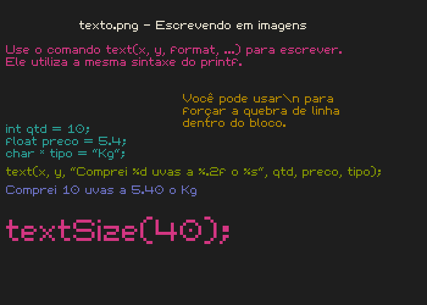
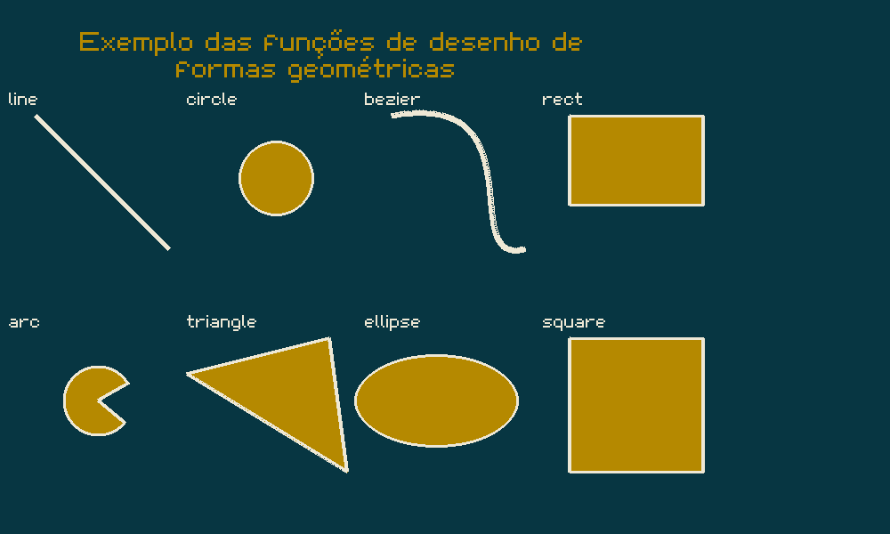
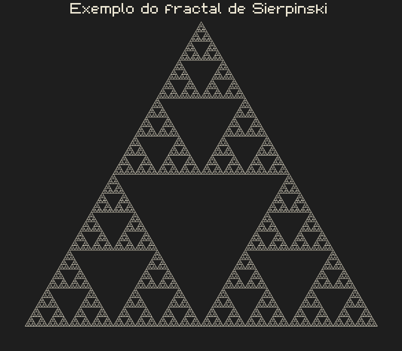
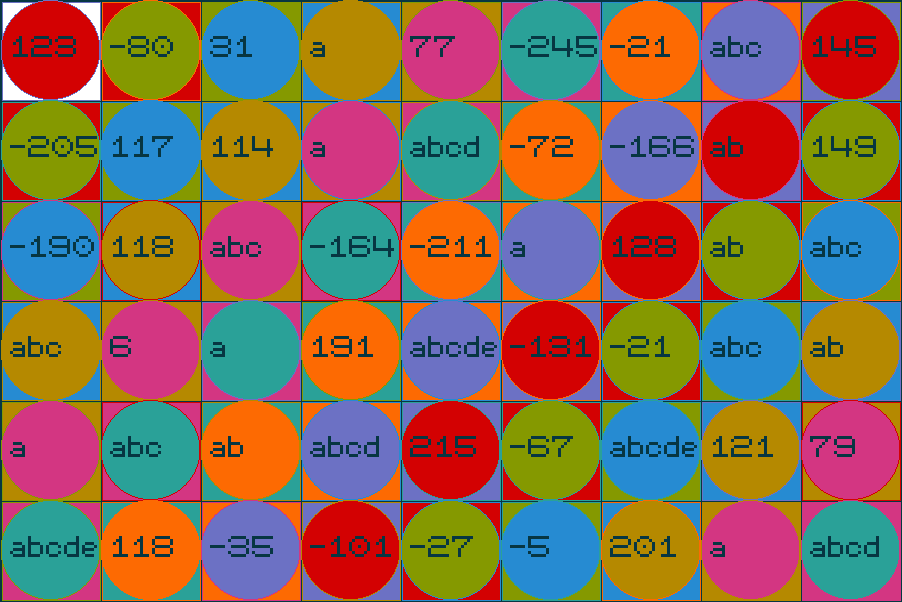

# Escrevendo, desenhando e pintando em PNGs usando C

O objetivo desse projeto é criar uma biblioteca header only para programar em C que seja capaz de criar, escrever e desenhar em pngs sem a necessidade de bibliotecas externas ou dependências.

---
## Instalação Local

Para utilizar, basta você baixar a biblioteca para o diretório onde está o seu código fonte, compilar e executar. Se estiver no linux, pode usar os seguintes comandos para baixar a biblioteca e rodar um exemplo.

```
wget https://raw.githubusercontent.com/senapk/xpaint/master/xpaint.h
wget https://raw.githubusercontent.com/senapk/xpaint/master/exemplo_base.c
gcc exemplo_base.c -o exemplo_base
./exemplo_base
```

Ao executar, deve ser criado o arquivo exemplo_base.png no seu diretório atual. 

Se estiver no windows, basta abrir os links e clicar em salvar como para salvar o arquivo.

- https://raw.githubusercontent.com/senapk/xpaint/master/xpaint.h


---
## Instalação Global

### Linux
```
sudo wget https://raw.githubusercontent.com/senapk/xpaint/master/xpaint.h -O /usr/local/include/xpaint.h
```

### Windows
Baixe o arquivo (xpaint.h)[https://raw.githubusercontent.com/senapk/xpaint/master/xpaint.h] e coloque dentro da pasta include da instalação do Mingw.


## Criando animações

O exemplo_movie.c mostra como criar animações. O nome do arquivo a ser gerado deve conter também o path onde os arquivos serão salvos.

Você pode usar a função `x_log()` ao invés do `x_save()` para salvar vários pngs em sequência numérica. 

Utilizando o ffmpeg, é possível juntar todos os pngs em uma animação através do comando:
```
ffmpeg -framerate 5 -pattern_type glob -i '*.png' -c:v libx264 -profile:v high -crf 20 -pix_fmt yuv420p video.mp4
```
O framerate define a quantidade de imagens por segundo, se quiser que passe mais tempo numa imagem, diminua o framerate.

Será gerado o arquivo video.mp4 na pasta atual.

---
## Funções

O código a seguir cria um bitmap, escreve um texto, pinta um círculo, salva no arquivo exemplo.png e sai. Você precisará apenas da biblioteca **xpaint.h** para o seu computador e criar o arquivo **exemplo_base.c** com o seguinte conteúdo.


```c
#define XPAINT_FULL   /*voce precisa desse define ANTES do include" */
#include "xpaint.h"

int main(){
    int largura = 600, altura = 500;
    /* cria um bitmap de 600x500 que irá salvar como figura_base.png*/
    x_open(largura, altura, "figura_base"); 
    /* escreve usando a font default na posicao x=50, y=30 */
    /* utilizando o mesmo formato do printf */
    x_write(50, 30, "Pintarei um circulo vermelho em %d %d", largura/2, altura/2);
    /* muda a cor do pincel para vermelho */
    x_set_color(X_COLOR_RED);
    /* desenha um circulo preenchido com centro no meio da tela e raio 200 */
    x_fill_circle(largura/2, altura/2, 200);
    /* salva no arquivo exemplo.png */
    x_save();
    /* libera os recursos alocados */
    x_close();
    return 0;
}
```

## Compilando e rodando

Se estiver fazendo manual, copie o arquivo xpaint.h para mesma pasta do seu código fonte e compile seu código manualmente.
```
# rodando pelo terminal
gcc exemplo.c -o exemplo
./exemplo
```

Ele deve gerar o arquivo figura_base.png que se parece com isso:


Outros código de exemplo estão nos arquivos que iniciam por exemplo_*, a saída deles pode ser vista abaixo.












Se você clonar esse repositório, entrar na pasta exemplos e der um make, ele vai compilar e re-gerar todas as figuras.

Esta é uma biblioteca header only, ou seja, não está dividida em .c e .h. Declarações e definições estão todas no .h. 

Se você der o include na biblioteca ele vai incluir as declarações apenas, ou seja, os cabeçalhos.
No módulo principal do seu programa, você deve dar o define `XPAINT_FULL` para incluir também as definições.

```
#define XPAINT_FULL
#include <xpaint.h> //se instalar globalmente
//ou
#include "xpaint.h" //se instalar localmente
```

# Documentação das funções

Você pode encontrar as funções todas documentadas no arquivo xpaint.h, mas eu copio e colo abaixo.

```c
/* struct que representa uma cor RGB */
typedef struct{
    uchar r;
    uchar g;
    uchar b;
    uchar a;
} X_Color;

/* lista de cores default */
extern X_Color X_COLOR_RED;
extern X_Color X_COLOR_GREEN;
extern X_Color X_COLOR_BLUE;
extern X_Color X_COLOR_YELLOW;
extern X_Color X_COLOR_CYAN;
extern X_Color X_COLOR_MAGENTA;
extern X_Color X_COLOR_ORANGE;
extern X_Color X_COLOR_VIOLET;
extern X_Color X_COLOR_WHITE;
extern X_Color X_COLOR_BLACK;

/* cria e retorna uma struct X_Color passando rgb */
X_Color x_make_color(uchar r, uchar g, uchar b, uchar a);

/*
###############################################
### FUNÇÕES SET: Cor, Fonte, Paleta de Cores ##
###############################################
*/

/* define uma cor na palheta de caracteres */
void x_set_palette(char c, X_Color color);

/* retorna uma cor dado um char.
   os char default da paleta são rgbmcybk
   outros podem ser definidos ou redefinidor com x_set_palette
*/
X_Color x_get_palette(char c);


/*
###############################################
######## ABRINDO, FECHANDO, SALVANDO ##########
###############################################
*/

/* @brief Open the board to draw */
/* @param filename path to save the png */
void x_open(unsigned int width, unsigned int height, const char * filename);

/* retorna altura, largura, filename and bitmap */
int           x_get_height(void);
int           x_get_width(void);
const char *  x_get_filename(void);
uchar       * x_get_bitmap(void);

/* @brief Clear all resources */
void x_close(void);

/* @brief Changes the the default filename to save the image */
/* @param filename path */
void x_set_filename(const char * filename);

/* define the path ou command to external tool to open the image in first save */
/* Ex: "eog", "gthumb" */
void x_set_viewer(const char * viewer);

/* a funcao plot pinta o pixel usando a cor padrão */
void x_plot(int x, int y);

/* retorna a cor do pixel dessa posicao do bitmap */
X_Color x_get_pixel(int x, int y);

/* muda a cor do pincel para todas as funcoes de desenho */
void x_set_color(X_Color color);

/* return the current color for brush */
X_Color x_get_color(void);

/* limpa a tela inteira com a mesma cor */
void x_clear(void);

/* save the bitmap in filename.png */
void x_save(void);

/*
    saves the file with a numeric sufix at the end
    if the filename is img, sequencial calls of this function
    will save the following files
    img_00000.png img_00001.png img_00002.png img_00003.png
*/
void x_log();

/* set the step for x_control */
void x_set_step(int value);

/* Interact with user to perform saves */
/* Returns true if save is should be done */
int x_control();

/* ############################################### */
/* ############ FUNÇÕES DE DESENHO DE LINHAS ##### */
/* ############################################### */

/* Desenha as seguintes formas sem preenchimento */

/* desenha uma linha com espessura de 1 pixel entre os pontos (x0, y0) e (x1, y1) */
void x_draw_line(int x0, int y0, int x1, int y1);

/* desenha uma linha com espessura de thickness pixels entre os pontos (x0, y0) e (x1, y1) */
void x_fill_line(float x0, float y0, float x1, float y1, int thickness);

/* desenha um circulo com centro (centerx, centerx) e raio radius */
void x_draw_circle(int centerx, int centery, int radius);

/* desenha um circulo dado centro e raio */
void x_fill_circle(int centerx, int centery, int radius);

/* desenha uma elipse dentro do rect de ponto superior esquerdo(x0, y0), largura e altura */
void x_draw_ellipse(int x0, int y0, int width, int height);

/* desenha uma elipse dentro do rect de ponto superior esquerdo(x0, y0), largura e altura */
void x_fill_ellipse(int x0, int y0, int width, int height);

/* desenha uma curva de bezier entre os pontos (x0, y0) e (x2, y2) */
/* a curvatura eh dada pelo ponto (x1, y1) */
void x_draw_bezier(int x0, int y0, int x1, int y1, int x2, int y2);

/* desenha um arco dado o ponto de centro, raio, espessura */
/* o angulo de inicio e o comprimento do arco em graus */
/* ambos os valores de ângulo podem ser negativos */
void x_fill_arc(float centerx, float centery, int radius, int thickness, int degrees_begin, int degrees_lenght);

/* desenha um triangulo dados os 3 vertices */
void x_fill_triangle(float v1x, float v1y, float v2x, float v2y, float v3x, float v3y);

/* desenha um retangulo dados os cantos superior esquerdo (x0, y0), largura e altura */
void x_fill_rect(int x0, int y0, int width, int height);


// muda o tamanho da font
void x_set_font_size(int size);

// escreve utilizando o formato printf
int  x_write(int x, int y, const char * format, ...);


/* Faz o SWAP entre dois tipos */
#define X_SWAP(x, y, T) do { T X_SWAP = x; x = y; y = X_SWAP; } while (0)

/*
###############################################
####### ALGEBRA DE VETORES BIDIMENSIONAIS #####
###############################################
*/

/* Define um vetor bidimensional com x e y */
typedef struct{
    double x;
    double y;
} X_V2d;

/* cria e retorna um vetor */
X_V2d x_make_v2d(double x, double y);

/* retorna o tamanho de um vetor da origem */
double x_v2d_length(double x, double y);

/* retorna a distancia entre dois pontos */
double x_v2d_distance(double ax, double ay, double bx, double by);

/* retorna a + b */
X_V2d x_v2d_sum(X_V2d a, X_V2d b);

/* retorna a - b */
X_V2d x_v2d_sub(X_V2d a, X_V2d b);

/* retorna (a.x * value, a.y * value) */
X_V2d x_v2d_dot(X_V2d a, double value);

/* retorna o vetor normalizado */
X_V2d x_v2d_normalize(X_V2d v);

/* retorna o vetor orthogonal */
X_V2d x_v2d_ortho(X_V2d v);

/*
###############################################
############ FUNÇÕES MATEMATICAS ##############
###############################################
*/

/*
Essas funções foram adicionadas para que a biblioteca
xpaint não dependesse de incluir a biblioteca math.h
nos parametros de compilação com o -lm
*/

double xm_sqrt(const double m);
double xm_pow( double x, double y );
int   xm_floor(double x);
double xm_fmod(double a, double b);
int   xm_ceil(double n);
/* degrees */
double xm_sin(double d);
double xm_cos(double d);
double xm_acos(double x);
double xm_fabs(double f);
/* Generates a int number in interval [min, max] */
int   xm_rand(int min, int max);


/*
###############################################
############ FUNÇÕES DE GRID ##################
###############################################
*/

/*Init the grid*/
/*side is the size of the cell */
/*sep the space in black between cells */
void x_grid_init(int side, int sep);

/*plots a square in cell*/
void x_grid_square(int l, int c);

/*plots a circle in cell*/
void x_grid_circle(int l, int c);

/*writes a number in cell*/
void x_grid_number(int l, int c, int value);

/*writes a text until 5 char in cell*/
void x_grid_text(int l, int c, const char *text);


/*
###############################################
####### FUNÇÕES PARA VISUALIZAR VETORES #######
###############################################
*/


/**
 * @brief initialize the module to print bars for show sort
 * 
 * @param size the size of the array
 * @param max the max value of the array
 */
void x_bar_init(int size, int max);

/**
 * @brief print a single bar
 * 
 * @param i the index
 * @param value the value of the bar size
 */
void x_bar_one(int i, int value);

/**
 * @brief show the entire array
 * 
 * @param vet the vector with the values
 * @param size of the vector
 * @param colors the array of color to mark unique elements or NULL
 * @param indices the array with the unique indices to be marked with the colors
 */
void x_bar_all(int * vet, int size, const char * colors, int * indices);


/*
###############################################
####### FUNÇÕES PARA DESENHAR COM A CANETA ####
###############################################
*/

void   x_pen_set_angle(double degrees);
void   x_pen_set_thick(int thick);
void   x_pen_set_pos(double x, double y);
double x_pen_get_angle();
int    x_pen_get_thick();
double x_pen_get_x();
double x_pen_get_y();
void   x_pen_up(void);
void   x_pen_down(void); 
void   x_pen_walk(double distance);
void   x_pen_rotate(int degrees);
void   x_pen_goto(double x, double y);

```