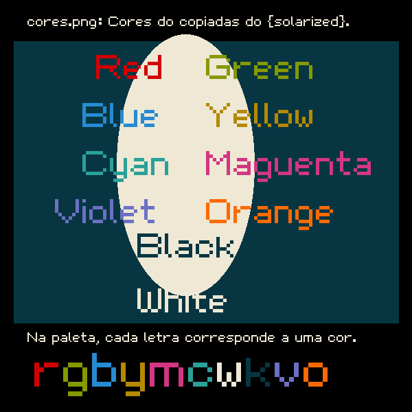
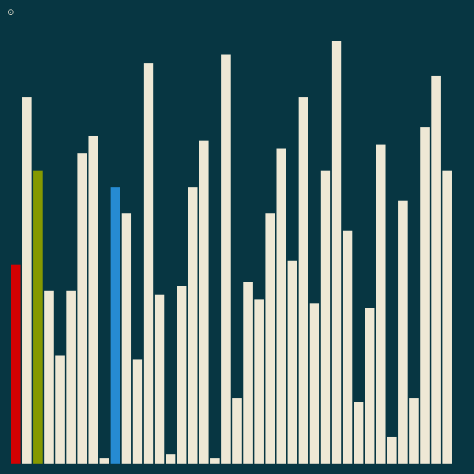

# Escrevendo, desenhando e pintando em PNGs usando C

O objetivo desse projeto é criar uma biblioteca header only para programar em C que seja capaz de criar, escrever e desenhar em pngs sem a necessidade de bibliotecas externas ou dependências.

<!--TOC_BEGIN-->
- [Instalação Local](#instalação-local)
- [Instalação Global](#instalação-global)
  - [Linux](#linux)
  - [Windows](#windows)
- [Criando animações](#criando-animações)
- [Funções](#funções)
- [Compilando e rodando](#compilando-e-rodando)
- [Guia de Funções](#guia-de-funções)
  - [Abrindo e fechando](#abrindo-e-fechando)
  - [Limpando, plotando e salvando](#limpando-plotando-e-salvando)
  - [Abrindo automaticamento a imagem gerada](#abrindo-automaticamento-a-imagem-gerada)
  - [Controle interativo](#controle-interativo)
  - [Cores](#cores)
  - [Desenhando](#desenhando)
  - [Escrevendo texto](#escrevendo-texto)
  - [Vetores bidimensionais](#vetores-bidimensionais)
  - [Funções Matemáticas](#funções-matemáticas)
  - [Módulo de Matrizes](#módulo-de-matrizes)
  - [Módulo de Vetores](#módulo-de-vetores)
  - [Módulo Turtle de Desenho](#módulo-turtle-de-desenho)
<!--TOC_END-->

---

## Instalação Local

Para utilizar, basta você baixar a biblioteca para o diretório onde está o seu código fonte, compilar e executar. Se estiver no linux, pode usar os seguintes comandos para baixar a biblioteca e rodar um exemplo.

```bash
curl https://raw.githubusercontent.com/senapk/xpaint/master/xpaint.h -o xpaint.h
curl https://raw.githubusercontent.com/senapk/xpaint/master/exemplo_base.c -o exemplo_base.c
gcc -Wall exemplo_base.c -o exemplo_base
./exemplo_base
```

Ao executar, deve ser criado o arquivo exemplo_base.png no seu diretório atual. 

Se estiver no windows, basta abrir os links e clicar em salvar como para salvar o arquivo.

```bash
- https://raw.githubusercontent.com/senapk/xpaint/master/xpaint.h
```

---

## Instalação Global

### Linux

```
sudo wget https://raw.githubusercontent.com/senapk/xpaint/master/xpaint.h -O /usr/local/include/xpaint.h
```

### Windows

Baixe o arquivo [xpaint.h](https://raw.githubusercontent.com/senapk/xpaint/master/xpaint.h) e coloque dentro da pasta include da instalação do Mingw.

---

## Funções

O código a seguir cria um bitmap, escreve um texto, pinta um círculo, salva no arquivo exemplo.png e sai. Você precisará apenas da biblioteca **xpaint.h** para o seu computador e criar o arquivo **exemplo_base.c** com o seguinte conteúdo.

<!-- load exemplo_base.c fenced -->

```c
#define XPAINT
#include "xpaint.h"

int main(){
    open(600, 500, "figura_base"); // cria uma tela de 600x500 com o nome figura_base
    background(BLACK); // limpa a tela com a cor preta
    stroke(WHITE); // muda a cor do pincel para branco
    textSize(20); // tamanho da fonte
    // escreve usando a sintaxe do printf
    text(50, 30, "Pintarei um circulo vermelho em %d %d", width() / 2, height()/ 2);
    fill(RED); // muda a cor de preenchimento para vermelho
    strokeWeight(5); // muda a espessura do pincel para 5
    circle(width()/2, height()/2, 200); // desenha um circulo no centro da tela com largura 200
    save(); // salva a imagem
    close(); // libera recursos alocados
    return 0;
}
```

<!-- load -->

## Compilando e rodando

Se estiver fazendo manual, copie o arquivo xpaint.h para mesma pasta do seu código fonte e compile seu código manualmente.

```bash
# rodando pelo terminal
gcc -Wall exemplo.c -o exemplo
./exemplo
```

Ele deve gerar o arquivo figura_base.png que se parece com isso:


Se você clonar esse repositório, entrar na pasta exemplos e der um make, ele vai compilar e re-gerar todas as figuras.

Esta é uma biblioteca header only, ou seja, não está dividida em .c e .h. Declarações e definições estão todas no .h. 

Se você der o include na biblioteca ele vai incluir as declarações apenas, ou seja, os cabeçalhos.
No módulo principal do seu programa, você deve dar o #define `XPAINT` para incluir também as definições.

```c
#define XPAINT
#include <xpaint.h> //se instalar globalmente
//ou
#include "xpaint.h" //se instalar localmente
```

## Guia de Funções

### Abrindo e fechando

```c
//inicia a figura
void open(unsigned int width, unsigned int height, const char * filename);  
// libera os recursos
void close();      
```

### Limpando, plotando e salvando

```c
void background(Color color);  // limpa a tela
void point(int x, int y);      // pinta o pixel usando a cor definida pelo stroke
void save(void);               // salva a figura no arquivo com o nome do arquivo que foi aberto o canvas

int  height(void);            // retorna altura
int  width(void);             // retorna largura
```

### Utilizando cores

```c
/* Cores default e char da paleta de cores */
#define WHITE     (Color) {238, 232, 213, 255} // w
#define BLACK     (Color) {7  , 54 , 66 , 255} // k
#define GREEN     (Color) {133, 153, 0  , 255} // g
#define RED       (Color) {211, 1  , 2  , 255} // r
#define BLUE      (Color) {38 , 139, 210, 255} // b
#define YELLOW    (Color) {181, 137, 0  , 255} // y
#define CYAN      (Color) {42 , 161, 152, 255} // c
#define MAGENTA   (Color) {211, 54 , 130, 255} // m
#define ORANGE    (Color) {253, 106,   2, 255} // o
#define VIOLET    (Color) {108, 113, 196, 255} // v

/* muda a cor do pincel*/
void stroke(Color color);

/* muda a cor de preenchimento das formas */
void fill(Color color);

```

### Controle interativo

```c
/* Enable interactive save and lock control */
void x_set_lock();

/*
    define folder to saves the file with a numeric sufix at the end
    if the filename is img, sequencial calls of this function
    will save the following files
    img_00000.png img_00001.png img_00002.png img_00003.png
*/
void x_set_log(const char * folder);

/* creates a .mp4 video using all .png stored in folder using ffmpeg */
void x_make_video(int framerate);

```

### Cores



```c
/* struct que representa uma cor RGBA */
typedef struct{
    uchar r;
    uchar g;
    uchar b;
    uchar a;
} Color;


Color rgba(uchar r, uchar g, uchar b, uchar a);

/* cria uma nova cor ou obtém uma cor da paleta, possui vários modos
1: uso de hexadecimal como : "#00ffbb"
2: uso de rgba entre virgulas "144,123,12,255"
3. tons de cinza entre 0 e 255: "100", "0", "150"
4: uso de palavras chave ou letras
    "black" ou "k"
    "white" ou "w"
    "red", "blue", "yellow", "pink", "cyan", ...
5: pode ser construído com a sintexa do printf
    ("%d, %d, %d", 10, 20 , 30)
*/
Color color(const char * format, ...);

/* define ou altera um cor na palheta de caracteres */
void setPalette(char c, Color color);
```

### Desenhando


```c

/* desenha uma linha entre os pontos (x0, y0) e (x1, y1) */
void line(int x0, int y0, int x1, int y1);

/* desenha um circulo com centro (centerx, centerx) e raio radius */
void circle(int centerx, int centery, int radius);

/* desenha uma elipse */
void ellipse(int centerx, int centery, int width, int height);

/* desenha um bezier dados os pontos de inicio A e fim D e os pontos de controle B e C */
void bezier(int xa, int ya, int xb, int yb, int xc, int yc, int xd, int yd);

/* desenha um arco dado o ponto de centro, raio, espessura */
/* o angulo de inicio e o comprimento do arco em graus */
/* ambos os valores de ângulo podem ser negativos */
void arc(double centerx, double centery, int radius, int thickness, int degrees_begin, int degrees_lenght);

/* desenha um triangulo dados os 3 vertices */
void triangle(double v1x, double v1y, double v2x, double v2y, double v3x, double v3y);

/* desenha um retangulo dados os cantos superior esquerdo (x0, y0), largura e altura */
void rect(int x0, int y0, int width, int height);

/* desenha um quadrado dados o canto superior esquerdo (x0, y0) e o lado */
void square(int x0, int y0, int side);

```

### Escrevendo texto


```c
// muda o tamanho da font
// OBS: a font só muda em múltiplos de 8, ex: 8, 16, 24, ...
void textSize(int size); 

// escreve utilizando o formato printf
int  text(int x, int y, const char * format, ...);

```

### Vetores bidimensionais

```c
/* Define um vetor bidimensional com x e y */
typedef struct{
    double x;
    double y;
} V2d;

/* cria e retorna um vetor */
V2d v2d(double x, double y);

/* retorna o tamanho de um vetor da origem */
double v2d_length(double x, double y);

/* retorna a distancia entre dois pontos */
double dist(double ax, double ay, double bx, double by);

/* retorna a + b */
X_V2d v2d_sum(X_V2d a, X_V2d b);

/* retorna a - b */
X_V2d v2d_sub(X_V2d a, X_V2d b);

/* retorna (a.x * value, a.y * value) */
X_V2d v2d_dot(X_V2d a, double value);

/* retorna o vetor normalizado */
X_V2d v2d_normalize(X_V2d v);

/* retorna o vetor orthogonal */
X_V2d v2d_ortho(X_V2d v);
```

### Funções Matemáticas

```c
/*
Essas funções foram adicionadas para que a biblioteca
xpaint não dependesse de incluir a biblioteca math.h
nos parametros de compilação com o -lm
*/

double xsqrt(const double m);
double xpow( double x, double y );
int    xfloor(double x);
double xfmod(double a, double b);
int    xceil(double n);
/* degrees */
double xsin(double d);
double xcos(double d);
double xacos(double x);
double xfabs(double f);
/* Generates a int number in interval [min, max] */
int    xrand(int min, int max);

```

### Módulo de Matrizes

[Código de matrizes](exemplos/exemplo_grid.c)


```c

/*
###############################################
############ FUNÇÕES DE GRID ##################
###############################################
*/

/*Init the grid*/
/*side is the size of the cell */
/*sep the space in black between cells */
void gridInit(int side, int sep);

/*plots a square in cell*/
void gridSquare(int l, int c);

/*plots a circle in cell*/
void gridCircle(int l, int c);

/*writes a text until 5 char in cell*/
void gridWrite(int l, int c, const char *format, ...);

```

### Módulo de Vetores



```c
/**
 * @brief initialize the module to print bars for show sort
 * 
 * @param size the size of the array
 * @param max the max value of the array
 */
void barInit(int size, int max);

/**
 * @brief print a single bar
 * 
 * @param i the index
 * @param value the value of the bar size
 */
void barOne(int i, int value);

/**
 * @brief show the entire array
 * 
 * @param vet the vector with the values
 * @param size of the vector
 * @param colors the array of color to mark unique elements or NULL
 * @param indices the array with the unique indices to be marked with the colors
 */
void barAll(int * vet, int size, const char * colors, int * indices);


/*
 * Save the array using vararg to pass multiple indexes 
*/
#define bar_save(vet, size, colors, ...)
```

### Módulo Turtle de Desenho

[Código do triângulo](exemplos/exemplo_triangulo.c)


[Código da árvore](exemplos/exemplo_arvore.c)


```c
void   penSetAngle(double degrees);
void   penSetThick(int thick);
void   penSetPos(double x, double y);
double penGetAngle();
int    penGetThick();
double penGetX();
double penGetY();
void   penUp(void);
void   penDown(void); 
void   penWalk(double distance);
void   penRotate(int degrees);
void   penGoto(double x, double y);

```

## Criando animações

O exemplo_insertion.c mostra como criar animações. O nome do arquivo a ser gerado deve conter também o path onde os arquivos serão salvos.

Você pode usar a função `setLog(folder)` para definir a pasta onde salvar cada save gerado. 

Utilizando o ffmpeg, é possível juntar todos os pngs em uma animação através do comando:

```bash
ffmpeg -framerate 5 -pattern_type glob -i '*.png' -c:v libx264 -profile:v high -crf 20 -pix_fmt yuv420p video.mp4
```

O framerate define a quantidade de imagens por segundo, se quiser que passe mais tempo numa imagem, diminua o framerate.

Será gerado o arquivo video.mp4 na pasta atual.
