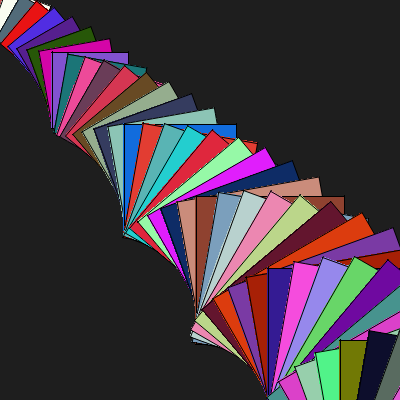
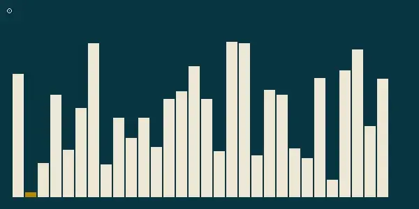

# Escrevendo, desenhando e pintando em PNGs usando C

O objetivo desse projeto é criar uma biblioteca header only para programar em C que seja capaz de criar, escrever e desenhar em pngs sem a necessidade de bibliotecas externas ou dependências.

<!-- toc -->
- [Instalação Local](#instalação-local)
- [Instalação Global](#instalação-global)
- [Instalando a versão de compilação RÁPIDA](#instalando-a-versão-de-compilação-rápida)
  - [Download do xpaint.c, xpaint.h, main.c e do Makefile](#download-do-xpaintc-xpainth-mainc-e-do-makefile)
- [Configurando o Replit](#configurando-o-replit)
- [Funções](#funções)
- [Compilando e rodando](#compilando-e-rodando)
- [Guia de Funções](#guia-de-funções)
  - [Abrindo, salvando e fechando](#abrindo-salvando-e-fechando)
  - [Utilizando cores](#utilizando-cores)
  - [Cores](#cores)
  - [Desenhando](#desenhando)
  - [Escrevendo texto](#escrevendo-texto)
  - [Transformações](#transformações)
  - [Vetores bidimensionais](#vetores-bidimensionais)
  - [Funções Matemáticas](#funções-matemáticas)
  - [Módulo Turtle de Desenho](#módulo-turtle-de-desenho)
  - [Módulo de Matrizes](#módulo-de-matrizes)
  - [Módulo de Vetores](#módulo-de-vetores)
  - [Criando animaçoes](#criando-animaçoes)
- [Jogos](#jogos)
<!-- toc -->

---

## Instalação Local

Para utilizar, basta você baixar a biblioteca para o diretório onde está o seu código fonte, compilar e executar. Se estiver no linux, pode usar os seguintes comandos para baixar a biblioteca e rodar um exemplo.

```bash
curl https://raw.githubusercontent.com/senapk/xpaint/master/mode_easy/xpaint.h -o xpaint.h
curl https://raw.githubusercontent.com/senapk/xpaint/master/mode_easy/main.c -o main.c
gcc -Wall main.c -o main.exe
./main.exe
```

Ao executar, deve ser criado o arquivo main.png no seu diretório atual.

Se estiver no windows, basta abrir os links e clicar em salvar como para salvar o arquivo.

```bash
- https://raw.githubusercontent.com/senapk/xpaint/master/modo_easy/xpaint.h
```

---

## Instalação Global

## Instalando a versão de compilação RÁPIDA

Para uma compilação mais rápida, você precisará utilizar um programa chamado `make`. Ele é um programa que lê um arquivo chamado `Makefile` e executa os comandos que estão nele. Isso possibilita que os módulos sejam compilados de forma independente e apenas os módulos que foram alterados sejam recompilados.

Para instalar o make no linux, basta rodar o comando:

```bash
sudo apt-get install make
```

Para instalar no windows, você pode baixar o make através do [chocolatey](https://chocolatey.org/).

```bash
choco install make
```

Como a xpaint para o make não é mais header only, você no download receberá dois arquivos, o `xpaint.c` e o `xpaint.h` e não precisa mais definir o `XPAINT` no seu código antes do include.

**ATENÇÃO**:

Na hora da compilação, o make vai pegar TODOS os arquivos .c que estiverem na pasta do Makefile para montar a solução. Então, renomeie para .txt os arquivos que você não quer que sejam compilados.

### Download do xpaint.c, xpaint.h, main.c e do Makefile

```bash
curl -sSL https://raw.githubusercontent.com/senapk/xpaint/master/install/install_make.sh | bash
```

## Configurando o Replit

- Crie um replit em C.
- Execute o comando de download do xpaint e do Makefile no shell do seu replit.
- Aperte o botão verde.

---

## Funções

O código a seguir é um exemplo de uso. Cada comando está comentado para facilitar o entendimento.

<!-- load mode_fast/main.c fenced -->

```c
#define XPAINT
#include "xpaint.h"

int main(){
    open(600, 400, "main"); // cria uma tela de 600x400 com o nome main.png
    background("0, 0, 0"); // limpa a tela com a cor preta usando rgb
    stroke("white"); // muda a cor do pincel para branco usando nome da cor
    textSize(20); // tamanho da fonte
    // escreve usando a sintaxe do printf
    text(50, 30, "Pintarei um circulo vermelho em %d %d", width() / 2, height()/ 2);
    fill("red"); // muda a cor de preenchimento para vermelho
    strokeWeight(5); // muda a espessura do pincel para 5
    circle(width()/2, height()/2, 200); // desenha um circulo no centro da tela com largura 200
    save(); // salva a imagem
    close(); // libera recursos alocados
    return 0;
}
```

<!-- load -->

## Compilando e rodando

Se estiver fazendo manual, copie o arquivo xpaint.h para mesma pasta do seu código fonte e compile seu código manualmente.

```bash
# rodando pelo terminal
gcc -Wall exemplo.c -o exemplo
./exemplo
```

Ele deve gerar o arquivo figura_base.png que se parece com isso:


Se você clonar esse repositório, entrar na pasta exemplos e der um make, ele vai compilar e re-gerar todas as figuras.

Se estiver utilizando a versão header-only da biblioteca, ela não está dividida em .c e .h. Declarações e definições estão todas no .h.

Se você der o include na biblioteca ele vai incluir as declarações apenas, ou seja, os cabeçalhos.
No módulo principal do seu programa, você deve dar o #define `XPAINT` para incluir também as definições.

```c
#define XPAINT // obrigatório no modo easy, desnecessário no modo fast
#include "xpaint.h" //se instalar localmente
```

## Guia de Funções

### Abrindo, salvando e fechando

```c
void open(largura, altura, arquivo); // inicia o canvas
void save();                         // gera o arquivo.png com o estado do canvas
void close();                        // fecha o canvas
void point(int x, int y);            // pinta o pixel na posição x, y
int  height();                       // retorna altura
int  width();                        // retorna largura
```

### Utilizando cores

```c
void background(const char* color, ...); // limpa a tela passando o texto
void     stroke(const char* color, ...); // muda a cor do ponto, linha e bordas
void       fill(const char* color, ...); // muda a cor de preenchimento
void  setStroke(Color color);   // muda a cor passando o objeto Color
void    setFill(Color color);   // muda a cor passando o objeto Color
void setPallete(const char * entry, Color color); // registra a cor na paleta
```

```c
// Os valores de texto podem ser passados como 
// hexadecimal "#ff00ff",
// rgb "255, 0, 255",
// rgba "255, 0, 255, 255",
// tons de cinza "100", "0", "150",
// palavras chave "black", "white", "red", "blue", "yellow", "pink", "cyan", ...
// letras "k" para black, "w" para white, "r" para red, "b" para blue, ...
// ou ainda com a sintaxe do printf ("255, %d, %d", xrand(255), xrand(255))
// exemplo de uso
background("#ff00ff"); // limpa a tela com a cor magenta
stroke("black"); // muda a cor do pincel para preto
fill("red"); // muda a cor de preenchimento para vermelho
stroke("255, 0, 0, 255"); // muda a cor do pincel para vermelho
// muda a cor de preenchimento para uma cor aleatória
fill("%d, %d, %d", xrand(255), xrand(255), xrand(255)); 

Color verde = color("33, 190, 30"); // cria a cor verde
setStroke(verde); // muda a cor do pincel para verde

// adicionando novas chaves na paleta de cores
setPallete("azul", color("0, 240, 250")); // registra a cor na paleta
stroke("azul"); // muda a cor do pincel para azul
```

### Cores

[Código das cores](exemplos/ex_cores.c)


```c
// struct que representa uma cor RGBA
typedef struct{
    uchar r;
    uchar g;
    uchar b;
    uchar a;
} Color;

// cria e retorna uma struct Color passando rgba
// rgba(255, 0, 0, 0); // vermelho
Color rgba(uchar r, uchar g, uchar b, uchar a);

/* cria uma nova cor ou obtém uma cor da paleta, possui vários modos
1: uso de hexadecimal como : "#00ffbb"
2: uso de rgba entre virgulas "144,123,12,255"
3. tons de cinza entre 0 e 255: "100", "0", "150"
4: uso de palavras chave ou letras
    "black" ou "k"
    "white" ou "w"
    "red", "blue", "yellow", "pink", "cyan", ...
5: pode ser construído com a sintex do printf
    color("%d, %d, %d", 10, 20, 30);
*/
Color color(const char * format, ...);

// define uma entrada na paleta de cores
// entry: chave para a cor, que pode ser uma letra ou palavra
// color: cor a ser registrada
void setPallete(const char * entry, Color color);
```

### Desenhando

[Código das figuras](exemplos/ex_draw.c)


```c

// muda a espessura do traço
void strokeWeight(int thickness);

/* desenha uma linha entre os pontos (x0, y0) e (x1, y1) */
void line(int x0, int y0, int x1, int y1);

/* desenha um circulo com centro (centerx, centerx) e raio radius */
void circle(int centerx, int centery, int radius);

/* desenha uma elipse */
void ellipse(int centerx, int centery, int width, int height);

/* desenha um bezier dados os pontos de inicio A e fim D e os pontos de controle B e C */
void bezier(int xa, int ya, int xb, int yb, int xc, int yc, int xd, int yd);

/* desenha um arco dado o ponto de centro, raio, espessura */
/* o angulo de inicio e o comprimento do arco em graus */
/* ambos os valores de ângulo podem ser negativos */
void arc(double centerx, double centery, int radius, int thickness, int degrees_begin, int degrees_lenght);

/* desenha um triangulo dados os 3 vertices */
void triangle(double v1x, double v1y, double v2x, double v2y, double v3x, double v3y);

/* desenha um retangulo dados os cantos superior esquerdo (x0, y0), largura e altura */
void rect(int x0, int y0, int width, int height);

/* desenha um quadrado dados o canto superior esquerdo (x0, y0) e o lado */
void square(int x0, int y0, int side);

```

### Escrevendo texto

[Código do texto](exemplos/ex_texto.c)


```c
// muda o tamanho da font
// OBS: a font só muda em múltiplos de 8, ex: 8, 16, 24, ...
void textSize(int size); 

// escreve utilizando o formato printf
// retorna a posicao final em x
// pode utilizar \n para quebra de linha
int  text(int x, int y, const char * format, ...);

```

### Transformações

[Código do Rotate](exemplos/ex_rotate.c)


[Código das Transformações](exemplos/ex_transf.c)



```c
// cria um camada de transformação
void push();
// desfaz a última camada de transformação
void pop();
// define a translação da camada de transformação atual
void translate(double dx, double dy);
// define a escala da camada de transformação atual
void scale(double s);
// define a rotação da camada de transformação atual
void rotate(double angle); 
```

### Vetores bidimensionais

[Código das Bolas](exemplos/ex_balls.c)


```c
// Define um vetor bidimensional com x e y
typedef struct{
    double x;
    double y;
} V2d;

// retorna a distancia entre dois pontos
double dist(double ax, double ay, double bx, double by);

// cria e retorna um vetor
V2d v2d(double x, double y);

// retorna o tamanho de um vetor da origem
double v2d_length(double x, double y);

// retorna a + b
V2d v2d_sum(V2d a, V2d b);

// retorna a - b
V2d v2d_sub(V2d a, V2d b);

// retorna (a.x * value, a.y * value)
V2d v2d_dot(V2d a, double value);

// retorna o vetor normalizado
V2d v2d_normalize(V2d v);

// retorna o vetor orthogonal
V2d v2d_ortho(V2d v);
```

### Funções Matemáticas

Essas funções foram adicionadas para que a biblioteca `xpaint` não dependesse de incluir a biblioteca `math.h` nos parametros de compilação com o `-lm`.

```c

// raiz quadrada
double xsqrt(const double m);

// função potência
double xpow( double x, double y );

// função piso
int    xfloor(double x);

// função de arredondamento
int    xround(double x);

// o módulo de um número, mas com o divisor sendo um double
double xfmod(double a, double b);

// função teto
int    xceil(double n);

// calcula o seno de um angulo em graus
double xsin(double d);

// calcula o cosseno de um angulo em graus
double xcos(double d);

// calcula o arco cosseno de x em graus
double xacos(double x);

// calcula o arco seno de x em graus
double xfabs(double f);

// gera um valor inteiro aleatório entre 0 e max
// não incluindo o max
int xrand(int int max);

// xrand intervalado: gera um valor inteiro 
// aleatório entre min e max não incluindo o max
int xrandi(int min, int max);

```

### Módulo Turtle de Desenho

[Código do triângulo](exemplos/ex_triangulo.c)


[Código da árvore](exemplos/ex_arvore.c)


```c
void   penSetAngle(double degrees);
void   penSetThick(int thick);
void   penSetPos(double x, double y);
double penGetAngle();
int    penGetThick();
double penGetX();
double penGetY();
void   penUp(void);
void   penDown(void); 
void   penWalk(double distance);
void   penRotate(int degrees);
void   penGoto(double x, double y);

```

### Módulo de Matrizes

[Código de matrizes](exemplos/ex_floodfill.cpp)


[Código de grid](exemplos/ex_grid.c)


```c

// inicia o grid
// side é o tamanho da célula
// sep é o espaço em preto entre as células
void gridInit(int side, int sep);

// plota um quadrado na célula
void gridSquare(int l, int c);

// plota um círculo na célula
void gridCircle(int l, int c);

// escreve um texto de até 5 caracteres na célula
void gridText(int l, int c, const char *format, ...);

```

### Módulo de Vetores


```c
// inicia o vetor
// size é o tamanho do vetor
// max é o valor máximo do vetor
void barInit(int size, int max);

// plota um valor no vetor
// i é a posição do valor
// value é o valor a ser plotado
void barDrawOne(int i, int value);

// plota todos os valores do vetor
// colors é um vetor de cores para marcar elementos únicos ou NULL
// os elementos a seguir são os índices a serem marcados pelas cores
void barDrawColors(int * vet, int size, const char * colors, ...);
```

### Criando animaçoes



```c
// habilita controle interativo dos loops no canvas
void setLock();

// define a pasta onde os arquivos serão salvos com um sufixo numérico no final
// se o nome do arquivo for img, chamadas sequenciais dessa função
// salvarão os seguintes arquivos
// img_00000.png img_00001.png img_00002.png img_00003.png
void setLog(const char * folder);

// chama a função ffmpeg para gerar um vídeo com os arquivos salvos
// na pasta definida por setLog
void makeVideo(int framerate, const char * filename);

```

O exemplo_insertion.c mostra como criar animações.

Você pode usar a função `setLog(folder)` para definir a pasta onde salvar cada save gerado.

Utilizando o ffmpeg, é possível juntar todos os pngs em uma animação através do comando:

Isso é feito automaticamente pela função `makeVideo(framerate, filename)`.

```bash
ffmpeg -framerate 5 -pattern_type glob -i '*.png' -c:v libx264 -profile:v high -crf 20 -pix_fmt yuv420p video.mp4
```

O framerate define a quantidade de imagens por segundo, se quiser que passe mais tempo numa imagem, diminua o framerate.

Será gerado o arquivo video.mp4 na pasta atual.

## Jogos

Como a imagem é atualizada enquanto o programa roda, e é possível o input pelo terminal, diversos jogos são possíveis de serem feitos.

[Código zero a 100](exemplos_jogos/zero_a_cem.c)


